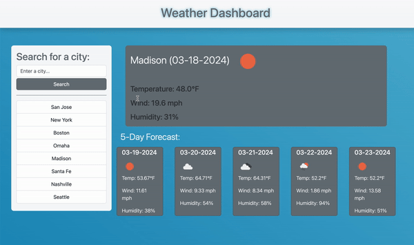

# 5-Day Forecast Weather Widget

## Table of Contents

* [Description](#description)
* [Usage](#usage)
* [Requirements](#requirements)
* [Technologies Used](#technologies-used)
* [Third Party APIs](#third-party-apis)
* [Credits](#credits)
* [License](#license)

## Description

The 5-Day Forecast Weather Widget is an app to view the 5-day forecast for a selected city. Forecast information for the selected city incudes: temperature in degrees fahrenheit, wind speed in miles per hour, and humidity as a percentage. This app utilizes OpenWeather API data obtained via the <code>fetch</code> request method.

The 5-Day Forecast Weather Widget app utilizes local storage to recall weather data of previously searched cities.

Given more time, a future improvement to this app could include additional search parameters, such as specification of state location in the case of cities of the same name.

## Usage

Upon opening the [5-Day Forecast Weather Widget](https://eepitsporsche.github.io/5_day_forecast_weather_widget/), the forecast card will be blank. When the user enters a city in the search field and presses the "Search" button, current forecast information for that city will be generated into the blank card. The 5-day forecast for that city will be generated beneath the current forecast card.

Cities searched will be logged to the search history on the page located beneath the search field. The user may click the button for a previously searched city, which will generate the forecast information for that city.

## Requirements

To operate the 5-Day Forecast Weather Widget, a user must have a browser that supports JavaScript and has it enabled.

## Technologies Used

Built with:
* HTML5
* Advanced CSS
* JavaScript
* [jQuery](https://jquery.com/)
* [Bootstrap](https://getbootstrap.com/)

## Third Party APIs

* [OpenWeather](https://api.openweathermap.org/data/2.5/&appid=6d920e83bac9f69207691c8489e7e7fc)
* [jQuery](https://code.jquery.com/jquery-3.4.1.min.js)
* [Day.js](https://cdn.jsdelivr.net/npm/dayjs@1.11.3/dayjs.min.js)
* [Bootstrap](https://cdn.jsdelivr.net/npm/bootstrap@5.1.3/dist/css/bootstrap.min.css)

## Credits

* [Bootstrap](https://getbootstrap.com/) was used for page structure and styling.

* [Visual Crossing](https://www.visualcrossing.com/resources/documentation/weather-api/how-to-load-weather-data-in-javascript/) was used for information on the <code>fetch</code>, <code>.then</code>, and <code>.catch</code> method.

* [Stack Overflow](https://stackoverflow.com/questions/67131224/fetching-openweather-forecast-using-javascript) was used to understand how to access data in the OpenWeather API.

## License
N/A

### 
[Back to Top](#5-day-forecast-weather-widget)
